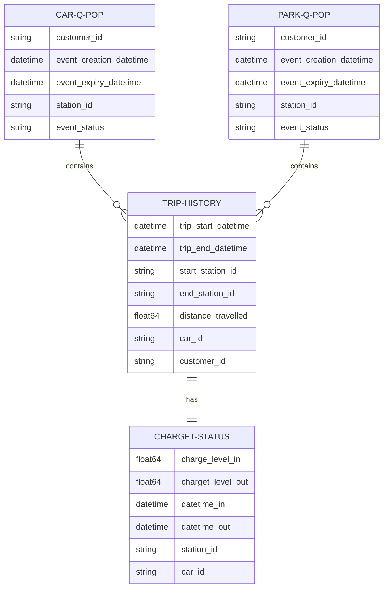
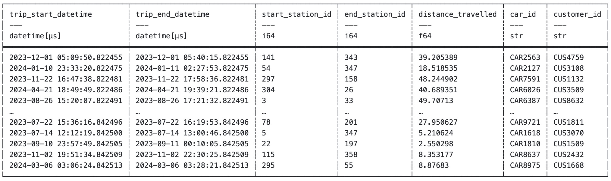
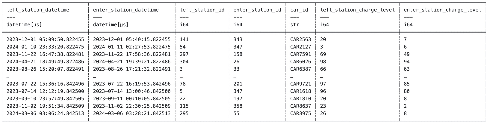
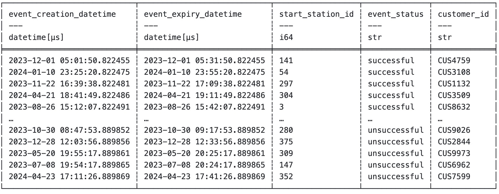
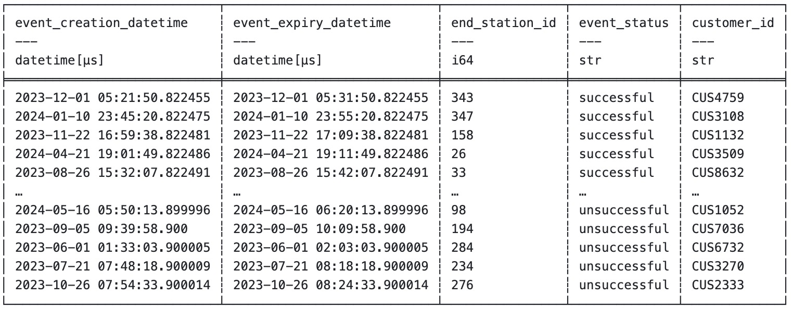

## Summary
This repository is dedicated to solving a complex optimization problem that arises in the context of car-sharing services. We want to determine which stations should be prioritized if the business is looking to increase the number of charging points per station from 4 to 6 to accommodate growing demand

### Data
Due to confidentiality restrictions, the actual dataset cannot be shared or viewed. Therefore, this project utilizes a synthetic dataset specifically designed to replicate the characteristics and behavior of the original data as closely as possible

### Data Schema and Entity Relationship

### Sample synthetic data

 
 

### Objective Function

Failed reservations for vehicles and parking spots directly correlate with user dissatisfaction, as each failed event can lead to frustration and potentially unsubscribing from the service. Measuring dissatisfaction through the number of failed car and parking reservation events provides a quantifiable metric to minimize. By increasing the number of charging points to fulfill unmet demands, we effectively reduce the likelihood of negative user experience. This approach not only enhances user experience and service reliability which aligns with the business objective of customer retention. 

### Objective Function and Constraints

The objective function to minimize total dissatisfaction can be formulated as:

\[
\text{Minimize} \quad D_{\text{total}} = \sum_{s \in S} \sum_{t \in T} \left( D_c \cdot f_c(s, t) + D_p \cdot f_p(s, t) \right)
\]

subject to the constraint:

\[
\sum_{s \in S} \text{cost\_per\_port} \cdot x_s \leq \text{budget}
\]

- **S**: Set of all charging stations.
- **T**: Set of all time periods.
- **fc(s, t)**: Number of failed car reservations at station *s* at time *t* due to lack of charging ports.
- **fp(s, t)**: Number of failed parking reservations at station *s* at time *t* due to lack of charging ports.
- **Dc**: Dissatisfaction cost per failed car reservation.
- **Dp**: Dissatisfaction cost per failed parking reservation.
- **xs**: Number of additional charging ports to install at station *s*.
- **c(s, t)**: Current capacity (number of charging ports) at station *s* at time *t*.

### How should the process data look like?

