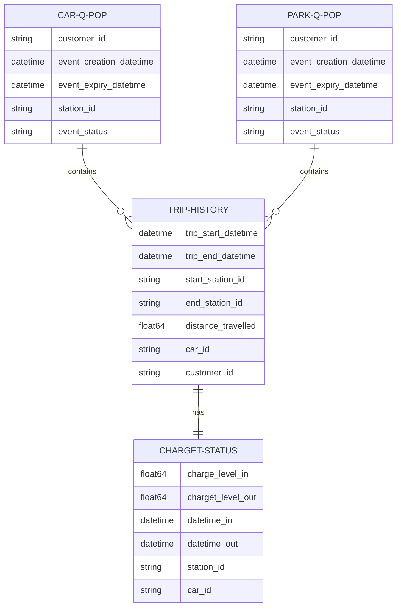

# Car sharing Case Study
This repository is dedicated to solving a complex optimization problem that arises in the context of car-sharing services. The problem involves determining the optimal number of charging ports to install at various stations to minimize dissatisfaction due to failed car and parking reservations.

## Data

The data used in this project is synthetically generated. This means that it's not based on real-world observations but is instead created artificially, often using random processes that mimic the real-world scenarios we're interested in. Synthetic data is a powerful tool for testing and development because it allows us to create a wide variety of scenarios that might not be readily available in collected datasets.

### Raw data

### Processed data that is ready for optimization

## Optimization Problem

The optimization problem we're solving is a form of resource allocation problem. We have a limited budget to install additional charging ports at various stations. The goal is to decide how many additional ports to install at each station in order to minimize the total dissatisfaction. Dissatisfaction is quantified based on the number of failed car and parking reservations, which occur when the demand exceeds the available resources.

The problem is solved using linear programming, a powerful mathematical technique for optimizing a linear objective function subject to linear equality and inequality constraints. The Python library `PuLP` is used to define and solve the problem.

