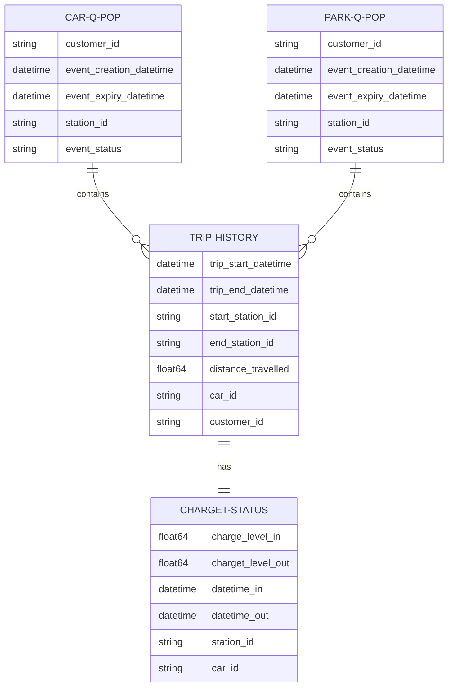
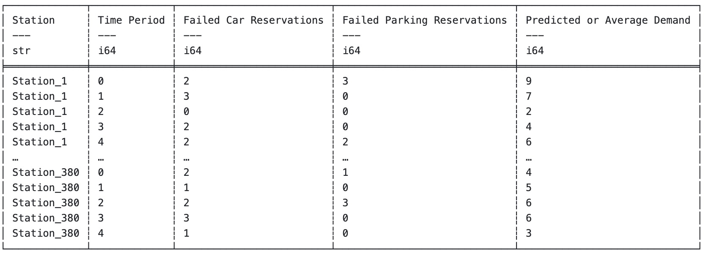
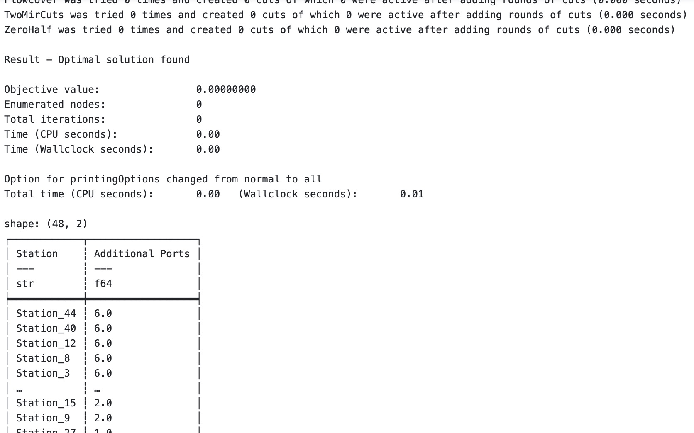

## Summary
This repository is dedicated to solving a complex optimization problem that arises in the context of car-sharing services. We want to determine which stations should be prioritized if the business is looking to increase the number of charging points per station from 4 to 6 to accommodate growing demand

### Data
Due to confidentiality restrictions, the actual dataset cannot be shared or viewed. Therefore, this project utilizes a synthetic dataset specifically designed to replicate the characteristics and behavior of the original data as closely as possible

### Data Schema and Entity Relationship

### Sample raw data (synthetic)

 
 

### Objective Function

Failed reservations for vehicles and parking spots **directly correlate with user dissatisfaction**, as each failed event can lead to frustration and potentially unsubscribing from the service. Measuring dissatisfaction through the number of failed car and parking reservation events provides a quantifiable metric to minimize. By increasing the number of charging points to fulfill unmet demands, we effectively reduce the likelihood of negative user experience. This approach not only enhances user experience and service reliability which aligns with the business objective of customer retention. 

<u>The objective can be formulated as:</u>
 

- **S**: Set of all charging stations.
- **T**: Set of all time periods.
- **fc(s, t)**: Number of failed car reservations at station *s* at time *t* due to lack of charging ports.
- **fp(s, t)**: Number of failed parking reservations at station *s* at time *t* due to lack of charging ports.
- **Dc**: Dissatisfaction cost per failed car reservation.
- **Dp**: Dissatisfaction cost per failed parking reservation.
- **xs**: Number of additional charging ports to install at station *s*.
- **c(s, t)**: Current capacity (number of charging ports) at station *s* at time *t*.

**Remark:** Assume the `dissatisfaction cost` for both car reservation and parking reservation to be the same, i.e., `1 unit each`

### Sample processed data (synthetic):
Ideally, we aim to have our daily aggregated or forecasted demand, along with the unmet demand, distributed evenly across various times of the day and different stations as follows:

### Additional considerations:
To prevent encountering an infeasible problem where the optimizer, in this case, a minimizer, can only deliver partial solutions. I have chosen not to set any upper limits on the number of additional charging ports required at each station or on the total budget. This strategy ensures that we can always generate a solvable solution to address all unmet demands comprehensively. From there, we will rank the stations by their demand in descending order. This ranking will then guide us in prioritizing which stations to upgrade first, ensuring an efficient allocation of resources based on actual demand levels.

### Sample final output

 

After evaluating the demand and sorting the stations in descending order, we can strategically prioritize the installation of additional charging ports. Based on available budget and cost considerations, we will focus on adding two more charging ports to the stations with the highest demand first.